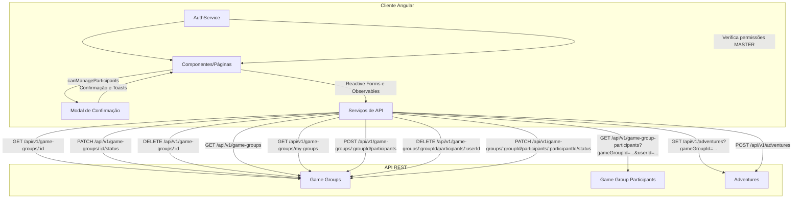
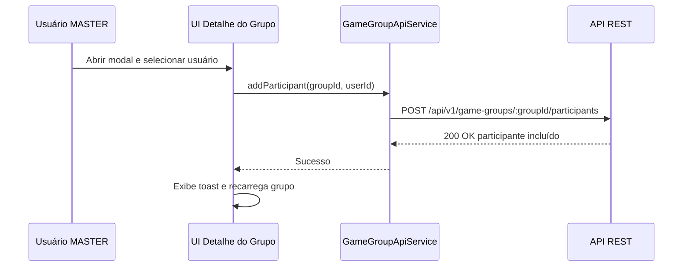
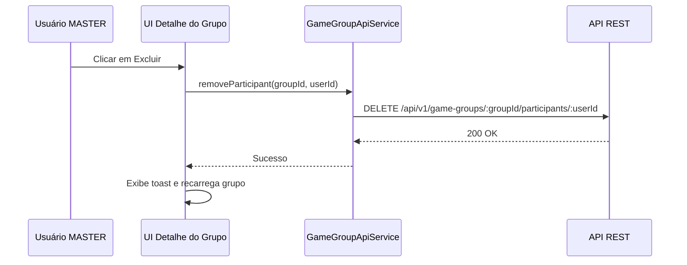

# System RPG

## Diagrama do Sistema

```mermaid
graph TD
  subgraph Client [Cliente Angular]
    UI[Componentes/Páginas]
    CM[Modal de Confirmação]
    SVC[Serviços de API]
    AUTH[AuthService]
  end

  subgraph Backend [API REST]
    GG[Game Groups]
    GP[Game Group Participants]
    ADV[Adventures]
  end

  UI -->|Reactive Forms e Observables| SVC
  AUTH --> UI

  SVC -->|GET /api/v1/game-groups/:id| GG
  SVC -->|PATCH /api/v1/game-groups/:id/status| GG
  SVC -->|DELETE /api/v1/game-groups/:id| GG
  SVC -->|GET /api/v1/game-groups| GG
  SVC -->|GET /api/v1/game-groups/my-groups| GG

  SVC -->|POST /api/v1/game-groups/:groupId/participants| GG
  SVC -->|DELETE /api/v1/game-groups/:groupId/participants/:userId| GG
  SVC -->|GET /api/v1/game-group-participants?gameGroupId=...&userId=...| GP
  SVC -->|PATCH /api/v1/game-groups/:groupId/participants/:participantId/status| GG

  SVC -->|GET /api/v1/adventures?gameGroupId=...| ADV
  SVC -->|POST /api/v1/adventures| ADV

  AUTH -->|Verifica permissões MASTER| UI
  UI -->|canManageParticipants| CM
  CM -->|Confirmação e Toasts| UI
```

### Fluxo: Inclusão de Usuário em Game Group

```mermaid
sequenceDiagram
  participant Master as Usuário MASTER
  participant UI as UI Detalhe do Grupo
  participant SVC as GameGroupApiService
  participant API as API REST

  Master->>UI: Abrir modal e selecionar usuário
  UI->>SVC: addParticipant(groupId, userId)
  SVC->>API: POST /api/v1/game-groups/:groupId/participants
  API-->>SVC: 200 OK participante incluído
  SVC-->>UI: Sucesso
  UI->>UI: Exibe toast e recarrega grupo
```

### Fluxo: Remoção de Participante

```mermaid
sequenceDiagram
  participant Master as Usuário MASTER
  participant UI as UI Detalhe do Grupo
  participant SVC as GameGroupApiService
  participant API as API REST

  Master->>UI: Clicar em Excluir
  UI->>SVC: removeParticipant(groupId, userId)
  SVC->>API: DELETE /api/v1/game-groups/:groupId/participants/:userId
  API-->>SVC: 200 OK
  SVC-->>UI: Sucesso
  UI->>UI: Exibe toast e recarrega grupo
```